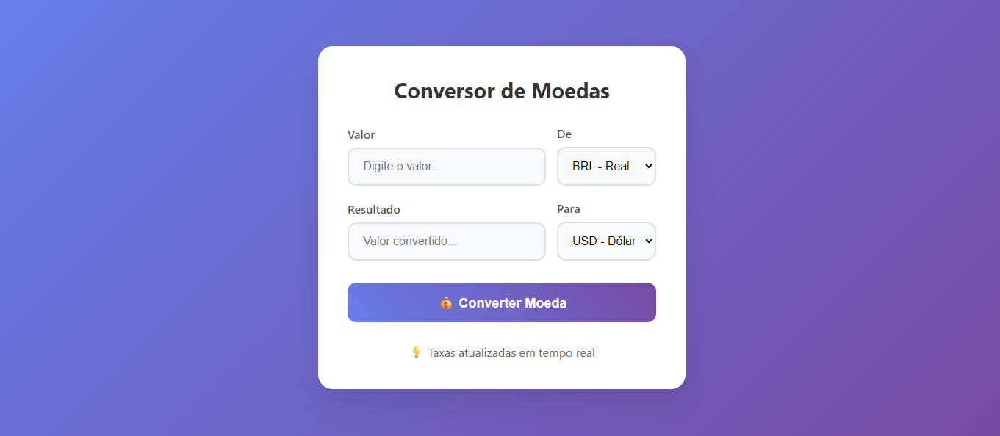
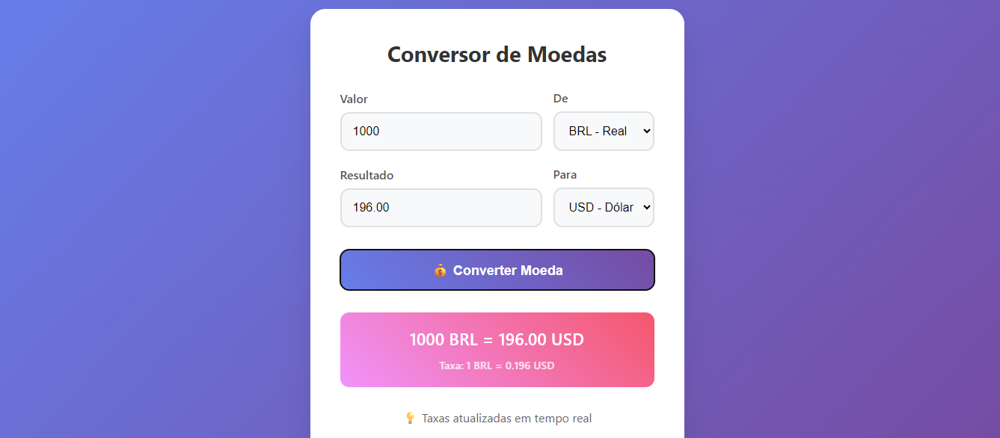
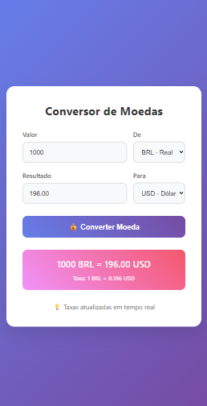

# Conversor de Moedas

Uma aplicação web simples e prática para converter valores entre diferentes moedas em tempo real, utilizando uma API de taxas de câmbio.

## ✨ O que a aplicação faz

Essa aplicação permite:

- inserir um valor para conversão;
- escolher a moeda de origem e a moeda de destino;
- visualizar o resultado da conversão com a taxa atual;
- usar uma interface simples, limpa e responsiva.

## 📸 Screenshots

  
  
  

## 🛠️ Tecnologias utilizadas

## 🚀 Como executar

1. Clone este repositório.
2. Abra a pasta do projeto no seu navegador.
3. Execute o arquivo index.html.

Se quiser, também é possível abrir o projeto em um servidor local para evitar problemas com alguns navegadores.

## 📌 Funcionalidades principais

- Conversão entre várias moedas;
- Exibição da taxa utilizada na conversão;
- Interface responsiva;
- Feedback visual enquanto a cotação é carregada.

## 💡 Observação

Este projeto é ótimo para praticar conceitos básicos de:

- HTML e CSS;
- JavaScript assíncrono;
- consumo de APIs;
- manipulação do DOM.

## 👨‍💻 Autor

Projeto desenvolvido como parte de um estudo inicial em desenvolvimento web.
